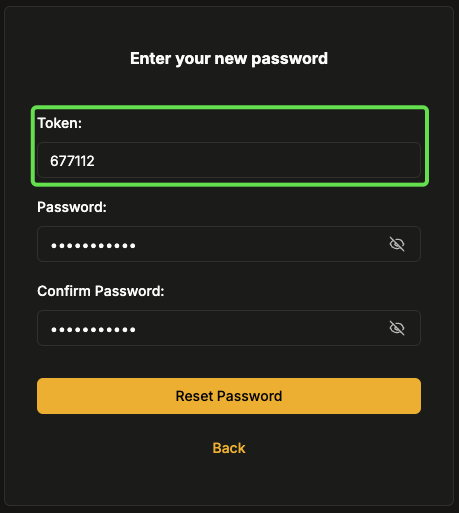
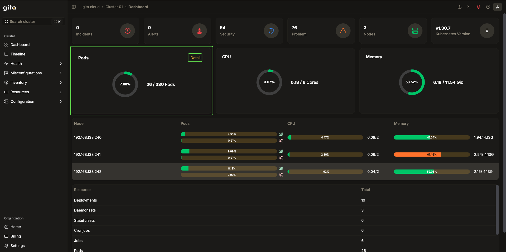
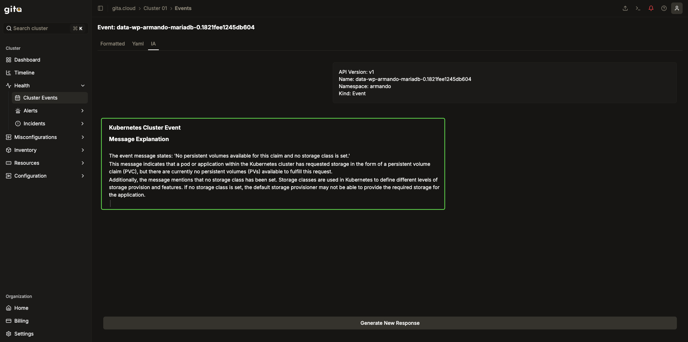

# How To

[Documento de referência](https://docs.google.com/document/d/110AwfPZy1QtPNDIHTp7vcrE4xnXYHog21635VR_DiQw/edit?usp=sharing)

## Como se registrar no GITA?

1. Acesse a [página de cadastro do GITA](https://app.gita.cloud/register)
    > 
    >
    > ***Imagem XX: Tela de nova conta no Gita***
2. Preencha os campos exibidos na imagem acima
3. Clique no botão **Sign Up**, conforme mostrado abaixoœ∑
    > 
    >
    > ***Imagem XX: Botão de cadastro***
4. Ao acionar o botão, um link de validação da conta será enviado para o endereço cadastrado. A tela do usuário será redirecionada para a mostrada na figura XXX.
5. Nesta tela, o usuário poderá solicitar que o sistema reenvie o e-mail de validação ao acionar o botão **Resend Link** ou retornar à tela de login com o botão **Back**. Conforme mostrado abaixo
    > 
    >
    > ***Imagem XX: Tela de validação do e-mail***
6. No e-mail informado, o usuário deverá acessar o link enviado por "**noreply@gita.cloud**" Para validar a conta.
7. Ao clicar no link, será redirecionado para o painel inicial do GITA, indicando que a operação foi realizada com sucesso.

## Como trocar a senha?

1. No painel do GITA, selecione o menu de definições (mostrado na figura abaixo), no canto superior direito e nele a opção "**Editar perfil**"
    > 
    >
    > ***Imagem XX: Menu definições***
2. Ao acessar a opção, o usuário será levado à tela abaixo, onde deverá procurar no menu lateral a opção "**Segurança**", conforme destacado na imagem abaixo.
    > 
    >
    > ***Imagem XX: Menu Editar perfil***
3. Na aba de segurança, o usuário deverá preencher os campos exibidos na figura abaixo e, em seguida, deverá clicar no botão clicar no botão "**Salvar**" para registrar a mudança.
    > 
    >
    > ***Imagem XX: Menu Editar perfil***
4. Se a operação foi concluída com sucesso, será exibida uma mensagem indicando sucesso no canto inferior direito.
    > 
    >
    > ***Imagem XX: Mensagem de sucesso na troca de senha***

## Como recuperar o acesso (senha)?

1. Na página de login do GITA, clique no link "**Esqueceu sua senha?/Forgot password?**". Conforme indicado abaixo:
    > 
    >
    > ***Imagem XX: Tela de login GITA***
2. Em seguida, o usuário será redirecionado para tela abaixo, na qual deverá preencher o campo exibido com o e-mail utilizado no cadastro na plataforma e depois clicar no botão destacado.
    > 
    >
    > ***Imagem XX: Tela esqueceu sua senha***
3. Ao acionar o botão, o usuário será redirecionado para a tela abaixo, na qual deverá inserir no campo destacado o token enviado para o e-mail do cadastro. Nos campos seguintes, deverá preencher com a nova senha e repeti-la para confirmar.
    > 
    >
    > ***Imagem XX: Tela definição da nova senha***
4. Após confirmar, clicando no botão "**Reset Password**", deverá aparecer no canto inferior direito uma mensagem indicando o sucesso da operação.
    > 
    >
    > ***Imagem XX: Mensagem indicando sucesso***

## Como criar uma nova organização?

1. No painel principal do GITA, clique no botão destacado abaixo, "**Criar Organização**":
    > 
    >
    > ***Imagem XX: Botão Criar Organização no painel principal***
2. Insira o nome desejado para a Organização no campo destacado e aperta em "**Criar**":
    > 
    >
    > ***Imagem XX: Tela - Criar organização***
3. O usuário será redirecionado para a página principal da organização onde poderá adicionar os clusters para o monitoramento e será exibida, no canto inferior direito, uma mensagem indicando o sucesso da operação.
    > 
    >
    > ***Imagem XX: Tela - Painel principal de organização***

## Como criar um novo cluster?

1. No painel principal da organização, o usuário deverá clicar em um dos botões destacados para adicionar um novo cluster à organização:
    > 
    >
    > ***Imagem XX: Tela - Painel principal da organização***
2. Em seguida, uma caixa de diálogo se abrirá e o usuário deverá definir o nome que o cluster receberá, clicando em "**Próximo**" para avançar para o próximo passo
    > 
    >
    > ***Imagem XX: Tela - Painel principal da organização***
3. O usuário, então, deverá definir algumas configurações do Cluster que será adicionado: se deseja adicionar um proxy, adicionar usuários, ativar execução de comandos e ativar logs. Após finalizar, o usuário deve prosseguir clicando no botão "**Create**"
    > 
    >
    > ***Imagem XX: Diálogo - Informações do Cluster***
4. O usuário será redirecionado para a tela abaixo, na qual deverá pegar os comandos destacados e executá-los na linha de comando do cluster.
    > 
    >
    > ***Imagem XX: Tela - Instalação Gita***
5. Após executar os comandos a plataforma deve exibir em "**Connected**" o status "**Online**", indicando que o cluster está se comunicando com o Gita.

## Como conseguir ajuda?

1. Em qualquer tela da plataforma, o usuário encontrará no canto superior direito o ícone para acessar a ajuda, como destacado na imagem abaixo.
    > 
    >
    > ***Imagem XX: Tela - Botão de ajuda***
2. Ao clicar no botão de ajuda, o usuário visualizará as opções de suporte oferecidas para o Gita:
    > 
    >
    > ***Imagem XX: Diálogo - Assistência com seu cluster***
3. Clicando na primeira opção "Solução de problemas" o usuário será redirecionado para XXXXXXXXXXXX
    > 
    >
    > ***Imagem XX: Tela - Solução de problemas***
4. Clicando na segunda opção "Docs" o usuário será levado para a documentação da plataforma, disponível em [doc.gita.cloud](https://doc.gita.cloud/).
    > 
    >
    > ***Imagem XX: Tela - Documentação oficial***
5. Clicando na terceira opção "Gita Status", o usuário será redirecionado para a tela mostrada abaixo, na qual poderá  visualizar o status de funcionamento dos componentes Gita:
    > 
    >
    > ***Imagem XX: Tela - Gita Status***

## Como ter uma visão geral do status de pod de todo cluster?

1. No painel principal do cluster, o usuário deverá procurar o botão "**Detalhes**" (destacado na imagem abaixo), dentro do quadro "**Pods**":
    > 
    >
    > ***Imagem XX: Tela - Painel principal Gita***
2. Ao entrar na seção "**Detalhes**", será possível visualizar todos os namespaces criados no cluster e, ao acessar as setas destacadas na imagem abaixo, todos os clusters que correspondem àquele namespace
    > 
    >
    > ***Imagem XX: Tela - Visualização de namespaces***
3. Clicando na seta destacada a cima, o usuário consegue visualizar todos os pods, seus estados e sua conexão com a rede:
    > 
    >
    > ***Imagem XX: Tela - Detalhes dos pods***
4. Clicando em um Pod específico, o usuário será redirecionado para a visão daquele pods, em questão, visualizando métricas, manifestos, grafos de dados, etc.
    > 
    >
    > ***Imagem XX: Tela - Detalhe do pods***

## Como pegar insights em eventos?

1. Por meio da barra lateral, o usuário poderá acessar o painel de eventos, conforme o destacado abaixo:
    > 
    >
    > ***Imagem XX: Barra lateral - Eventos do cluster***
2. Ao acessar, o usuário conseguirá visualizar todos os eventos que aconteceram no cluster, filtrar sua visualização de acordo com os dados que estiver buscando.
    > 
    >
    > ***Imagem XX: Painel - Eventos do cluster***
3. Ao clicar em um determinado evento, o usuário será redirecionado para a tela mostrada a baixo. Nela será possível detalhar o evento selecionado em três formas: formatado, yaml e IA. A primeira, exibida por padrão, condensa algumas informações do evento em uma visualização formatada:
    > 
    >
    > ***Imagem XX: Painel - Evento formatado***
4. A visualização **YAML** exibe na tela o manifesto correspondendo ao evento selecionado:
    > 
    >
    > ***Imagem XX: Painel - Manifesto Evento***
5. Já a opção "**IA**" consome os detalhes do evento selecionado e leva para uma inteligência artificial descrever, em linguagem natural, o que aconteceu:
    > 
    >
    > ***Imagem XX: Painel - Detalhes do evento gerados por IA***
