# Configuração de Proxy do Cliente em um Cluster

Este documento descreve o procedimento para configurar um proxy do cliente em um cluster, seja durante a adição do cluster ou posteriormente, via configurações.

## Opção 1: Durante a Adição do Cluster

1. Escolha sua organização.
2. Acesse o painel inicial da organização e clique em **Add Cluster**.
   >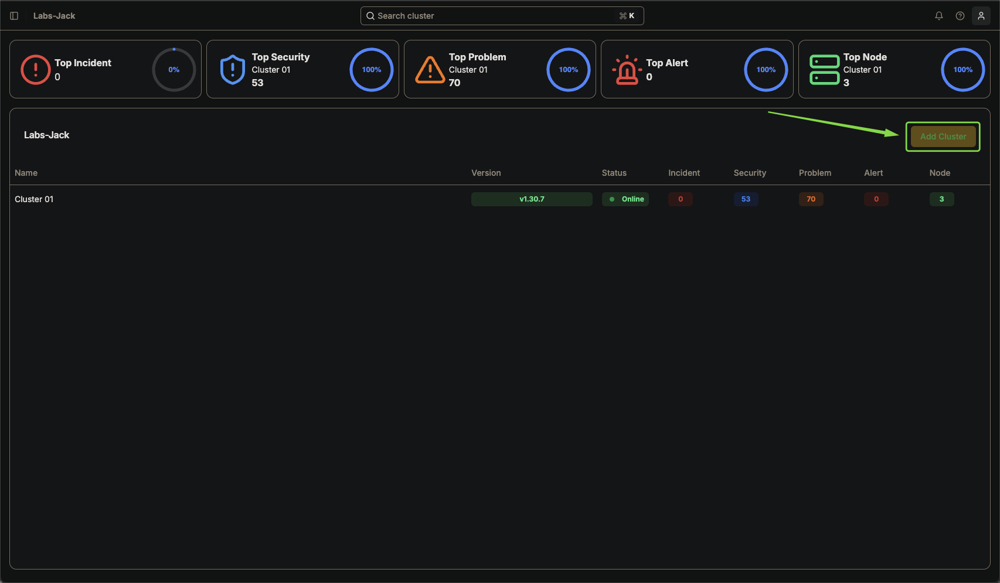
   >
   >Imagem 02: Botão Add Cluster
3. Insira o nome do cluster e clique em **Next**.
   >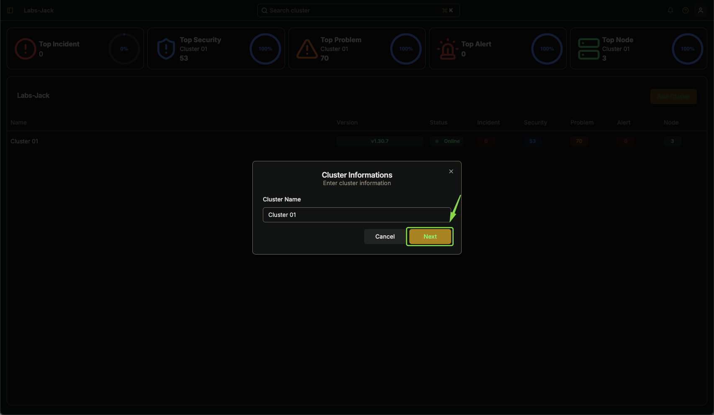
   >
   >Imagem 03: Botão Next
4. Para configurar o proxy, clique em **Add Proxy**.
   >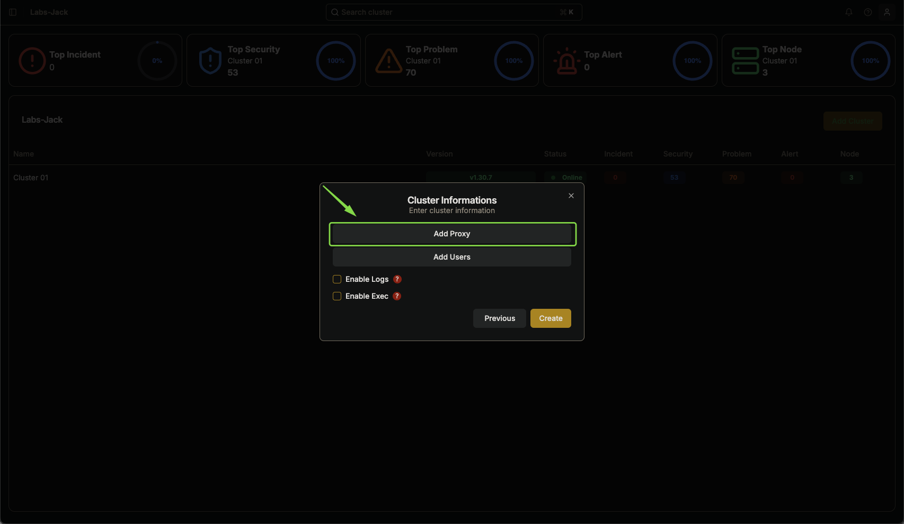
   >
   >Imagem 04: Tela - Configuração Proxy

5.  Preencha os campos obrigatórios do proxy que são essenciais para definir como a comunicação será roteada através do proxy.

   >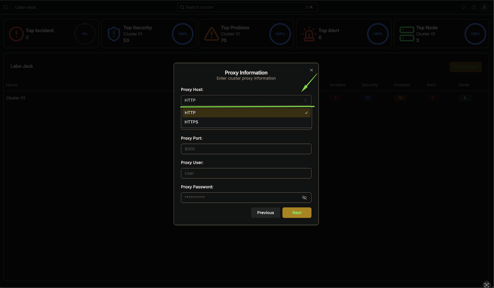
   >
   >Imagem 05: Formulário de configuração

   - **Proxy Host** Http/Https (Indicativo se a conexão terá criptografia ou não)- **Proxy Host** (Campo para definir o hostname ou IP proxy)
   - **Proxy Port** (Define o canal de comunicação com o proxy.)
   - **Proxy User** (campo armazena o nome de usuário necessário para se autenticar no proxy.)
   - **Proxy Password**(Senha correspondente ao nome de usuário)

6.  Revise as configurações inseridas e clique em **Next**.

      >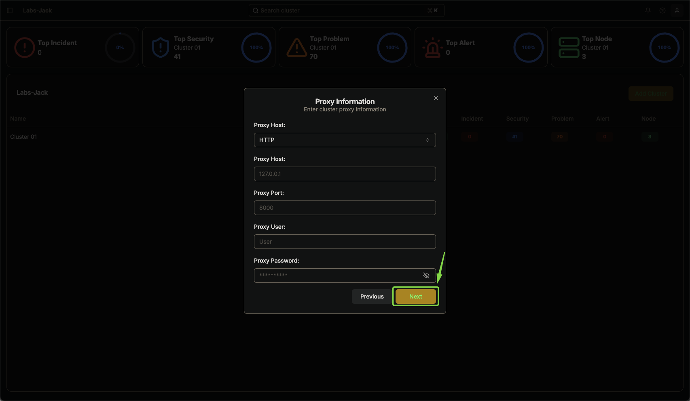
      >
      >Imagem 06: Botão para avançar
   

7. Caso queira habilitar logs e execução remota, ative as opções:
   - **Enable Logs**: Permite visualizar logs de aplicações no cluster.
   - **Enable Exec**: Permite executar comandos remotamente no cluster.

   >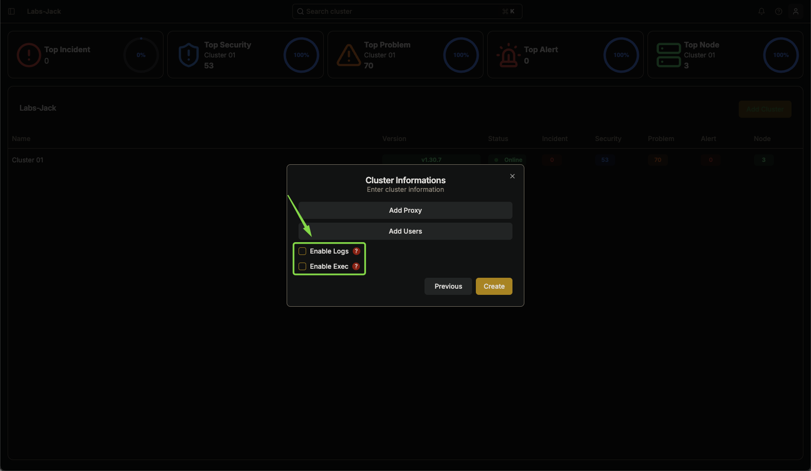
   >
   >Imagem 07: Habilitação de Logs e Execução Remota

8. No canto inferior esquerdo, clique em **Create** para concluir a configuração.

   >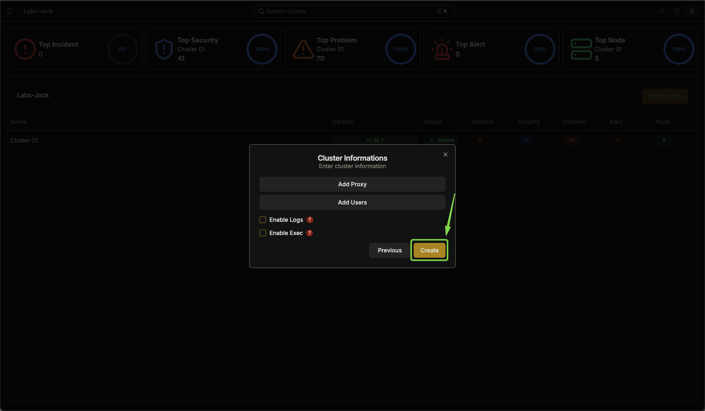
   >
   >Imagem 08: Criação do Cluster

---

## Opção 2: Após Adicionar o Cluster

1. Acesse o menu no canto superior esquerdo e abra a navbar.
   >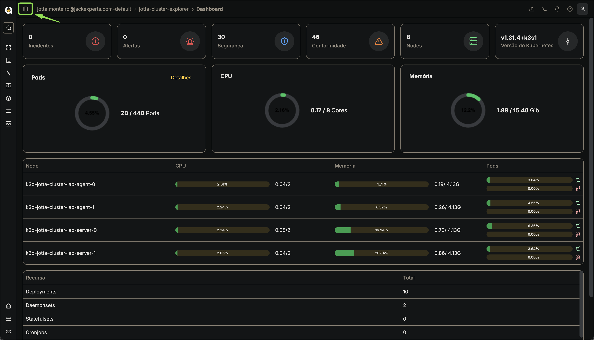
   >
   >Imagem 01: Botão canto superior esquerdo, aba menu lateral

2. Navegue até **Configuration → Settings**.
   >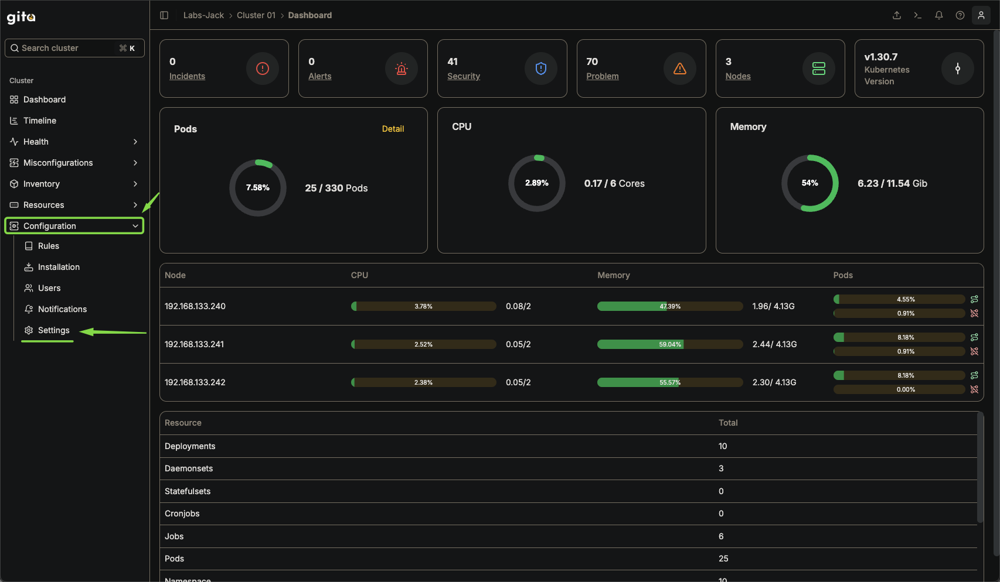
   >
   >Imagem 02: Tela - Indicação de seleção
3. Clique na aba **Proxy**.
   >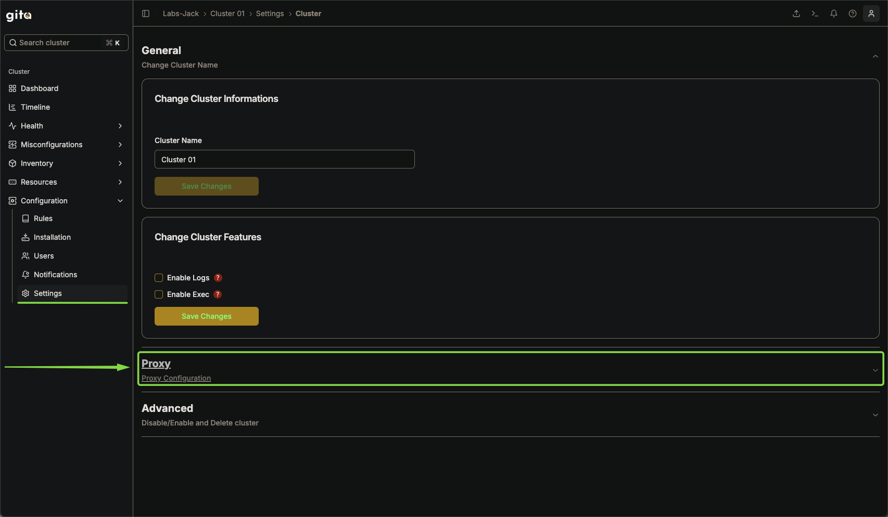
   >
   >Imagem 03: Opção de configuração Proxy
4. Preencha os detalhes do proxy conforme os requisitos.
   Podendo consultar detalhes do preenchimento dos campos na sessão [1.5](#detalhamento).
5. Clique em **Create Configuration**.
   >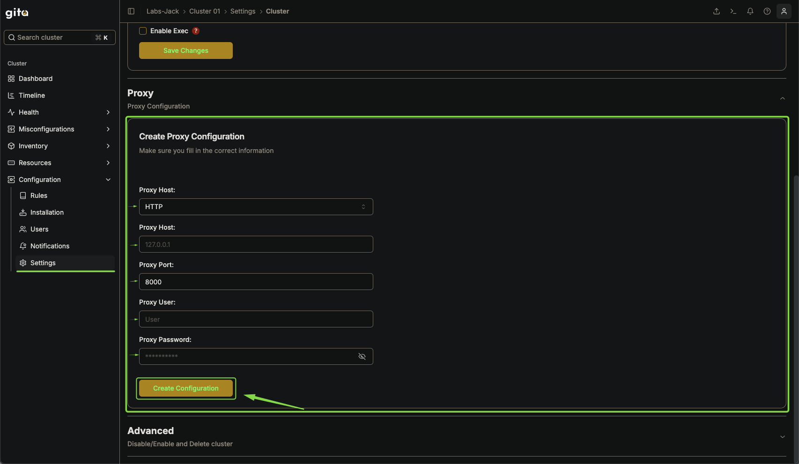
   >
   >Imagem 04: Indicação de botão para criação do Proxy

1. Aguarde a mensagem de sucesso confirmando a configuração.

   >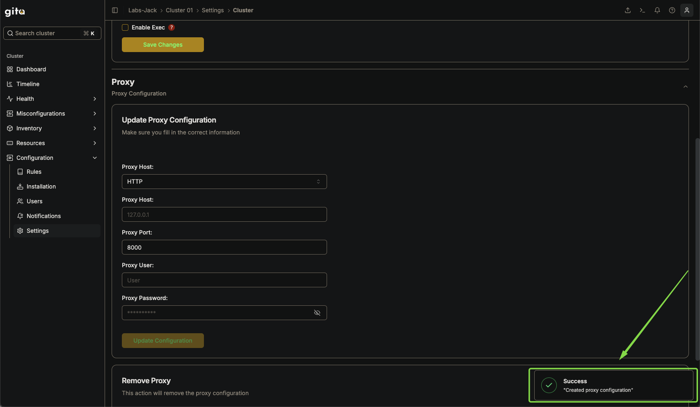
   >
   >Imagem 05: Imagem representando sucesso na configuração

---

## Remover Proxy

1. Acesse **Configuration → Settings**.
   >
   >
   >Imagem 01:  Indicação de seleção
2. Selecione a aba **Remover Proxy**.
   >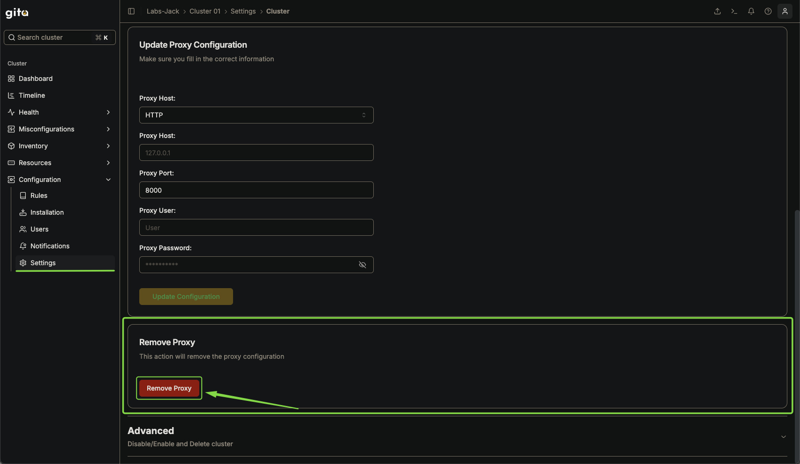
   >
   >Imagem 02: Botão de remoção da configuração Proxy
3. Clique na opção **Remover Proxy**.
   >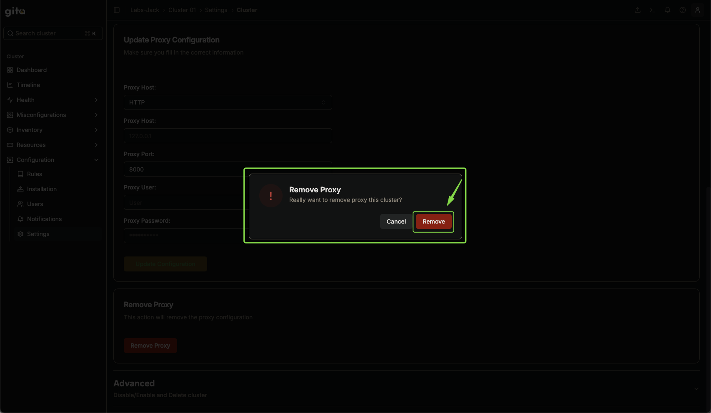
   >
   >Imagem 03: Tela - confirmação de delete da configuração
4. Confirme a remoção e aguarde a notificação de sucesso.

   >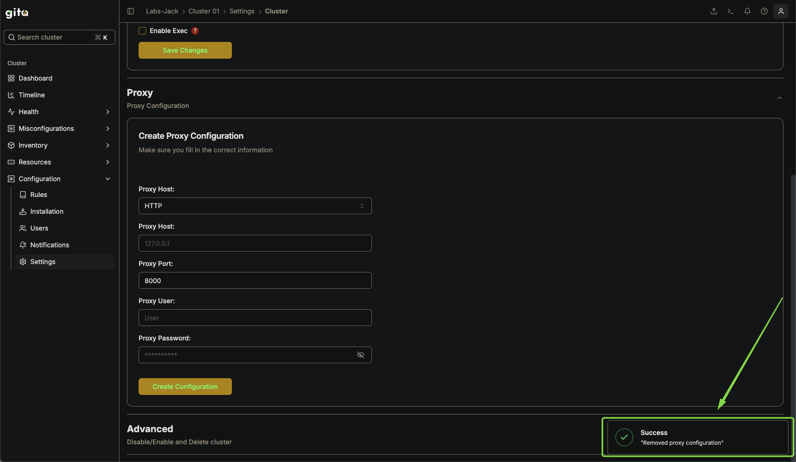
   >
   >Imagem XX: Imagem representando sucesso na remoção

---

### Recomendações

- Certifique-se de que as credenciais do proxy estejam corretas antes de aplicá-las.
- Caso o proxy exija autenticação, valide se o método de autenticação está compatível com a sua infraestrutura.
- Após a configuração, teste a conectividade para garantir que o proxy foi corretamente implementado.