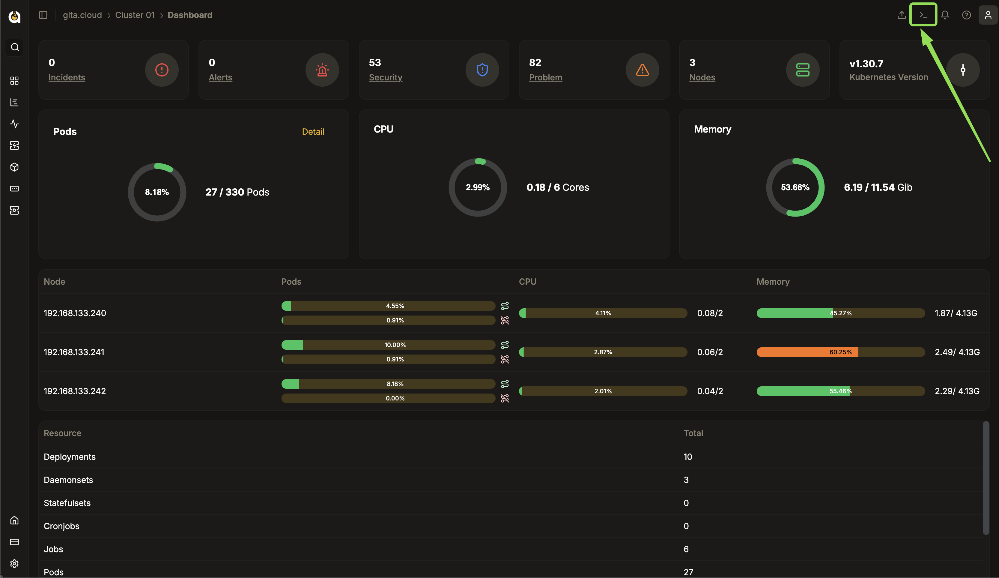

# Como Abrir uma Sessão de Console do Cluster no Gita

Este Procedimento Operacional Padrão (POP) tem o objetivo de orientar os usuários sobre como acessar o console de um cluster dentro da plataforma Gita, permitindo a manipulação direta do ambiente via linha de comando.

---

## 1. Objetivo
O console do cluster permite a execução de comandos administrativos e de monitoramento diretamente na plataforma, facilitando a gestão dos recursos do cluster.

---

## 2. Acessando o Console

1. **Acesse a plataforma Gita** e faça login com suas credenciais.
2. **Escolha a organização** onde o cluster desejado está localizado.
3. **Selecione o cluster** ao qual deseja se conectar.

   >
   >
   >Imagem XX:

4. **No canto superior direito da interface**, localize o ícone do console (representado por um terminal).
5. **Clique no ícone do console** para abrir uma nova aba na parte inferior da tela.

   >
   >
   >Imagem XX:

6. Agora, a aba do console estará disponível para gerenciamento do cluster.

   >
   >
   >Imagem XX:

---

## 3. Executando Comandos no Console

1. **Após abrir o console**, utilize comandos para interagir com o cluster.
2. Como por exemplo o comando para listar os pods no namespace padrão (`default`), utilize o seguinte comando:
   
   ```sh
   kubectl get pods
   ```

   >
   >
   >Imagem XX:


3. Para sair do console, basta fechar a aba na interface clicando no **X**
   >
   >
   >Imagem XX:


## 4. Observações Importantes

- **Certifique-se de ter as permissões adequadas** para acessar o console e executar comandos no cluster.
- **Verifique a conectividade da sua rede**, pois problemas de conexão podem impedir a abertura do console.
- **Utilize comandos com cautela**, pois ações como deletar pods podem impactar a operação do cluster.
- **Para mais informações sobre comandos disponíveis**, consulte a documentação oficial do Kubernetes ou utilize `kubectl --help`.